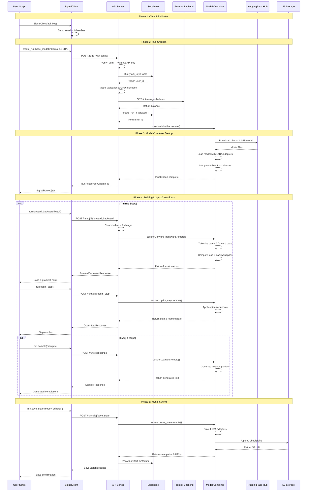
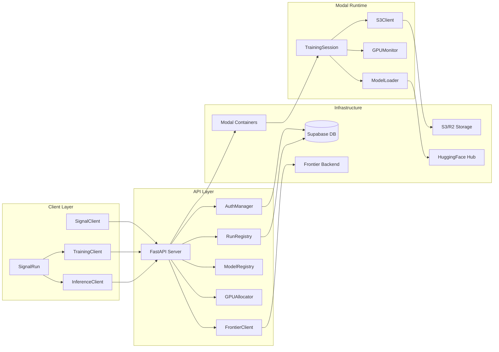
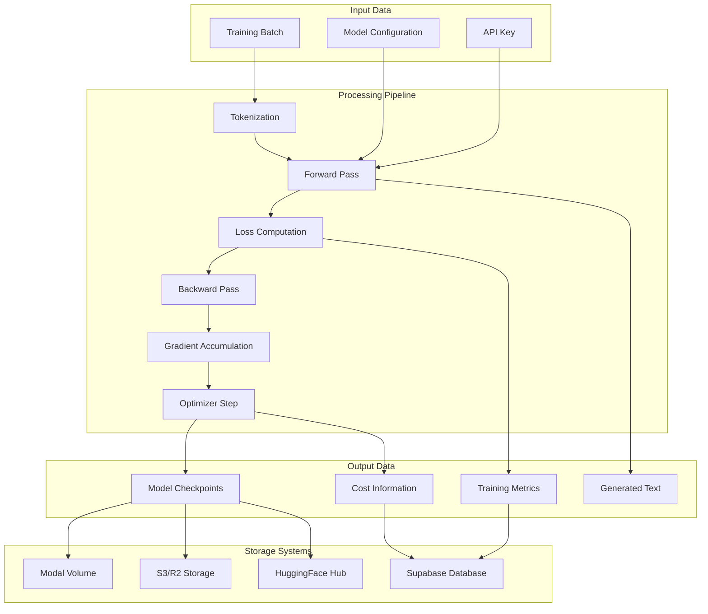
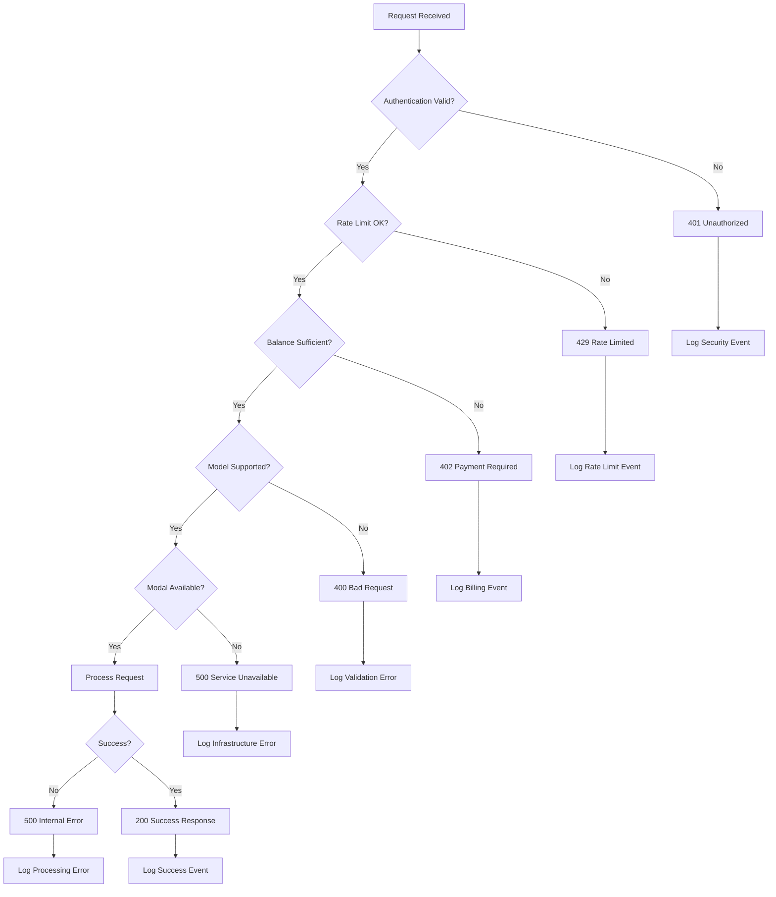

# Signal API Complete Flow Visualization

## High-Level Architecture Flow

```mermaid
graph TB
    subgraph "User Environment"
        A[User runs simple_example.py] --> B[SignalClient initialization]
        B --> C[Create Run Request]
    end
    
    subgraph "API Server (FastAPI)"
        C --> D[Authentication & Rate Limiting]
        D --> E[Model Validation & GPU Allocation]
        E --> F[Balance Check via Frontier Backend]
        F --> G[Run Registry (Supabase)]
        G --> H[Modal Container Lookup]
    end
    
    subgraph "Modal Infrastructure"
        H --> I[TrainingSession Container]
        I --> J[Model Loading & Initialization]
        J --> K[Ready for Training]
    end
    
    subgraph "Training Loop"
        K --> L[Forward-Backward Pass]
        L --> M[Optimizer Step]
        M --> N[Sample Generation]
        N --> O[Save State]
        O --> P{More Steps?}
        P -->|Yes| L
        P -->|No| Q[Training Complete]
    end
    
    subgraph "External Services"
        R[Supabase Database]
        S[Frontier Backend]
        T[S3/R2 Storage]
        U[HuggingFace Hub]
    end
    
    G -.-> R
    F -.-> S
    O -.-> T
    O -.-> U
```

## Detailed Request Flow



## Component Interaction Map



## Data Flow Architecture



## Performance Characteristics

```mermaid
gantt
    title Signal API Performance Timeline
    dateFormat X
    axisFormat %s
    
    section Cold Start
    Client Init           :0, 1
    API Auth             :1, 2
    Model Loading        :2, 62
    Container Ready      :62, 63
    
    section Warm Operations
    Forward-Backward     :63, 68
    Optimizer Step       :68, 69
    Sample Generation    :69, 79
    Save State           :79, 109
    
    section Training Loop
    Step 1-20            :109, 209
    Gradient Accumulation:209, 309
    Learning Rate Sched  :309, 409
```



## Error Handling Flow



This comprehensive visualization shows the complete flow of the Signal API from user script execution through all the infrastructure components, highlighting the key interactions, data flows, and performance characteristics.
