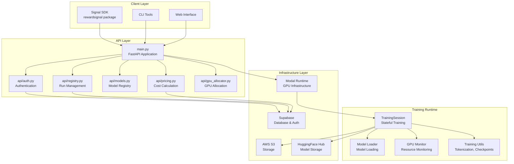
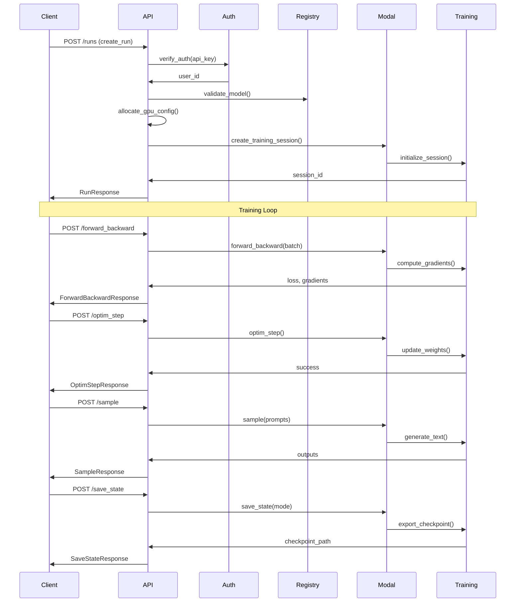
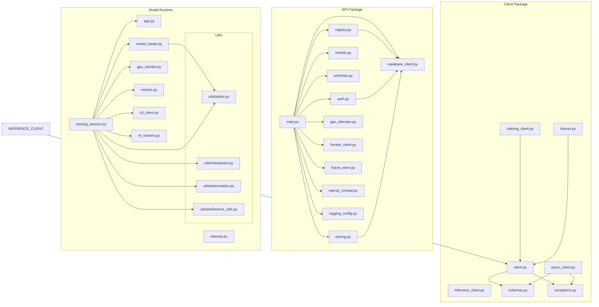
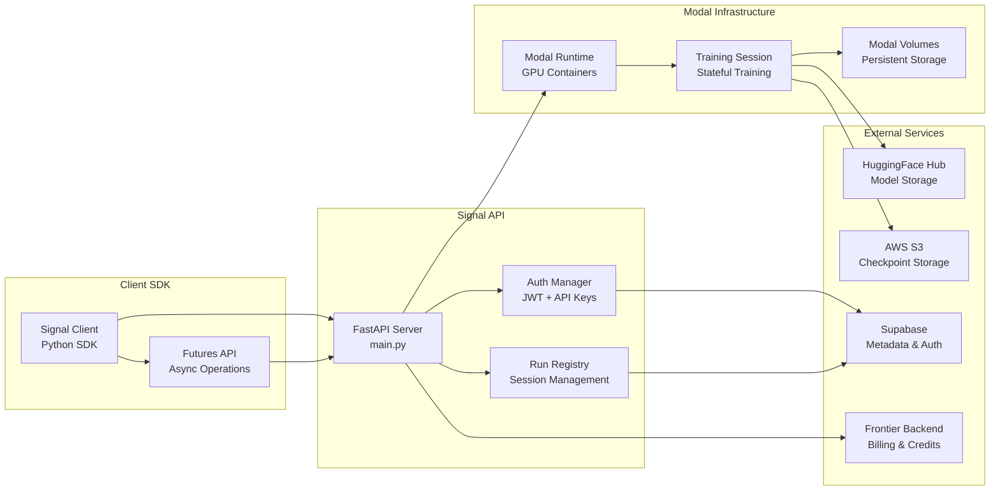
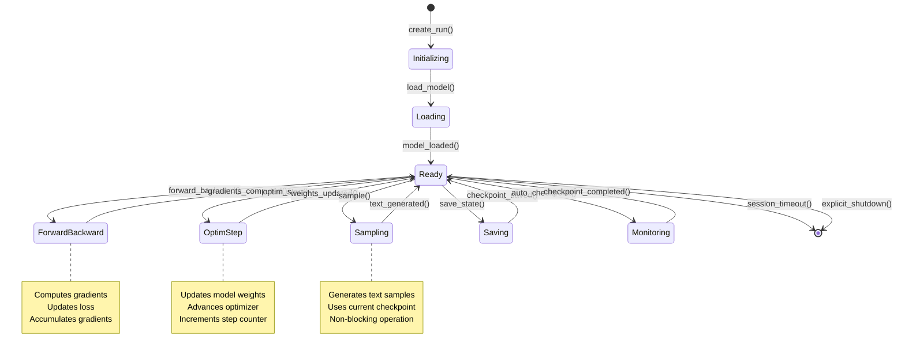
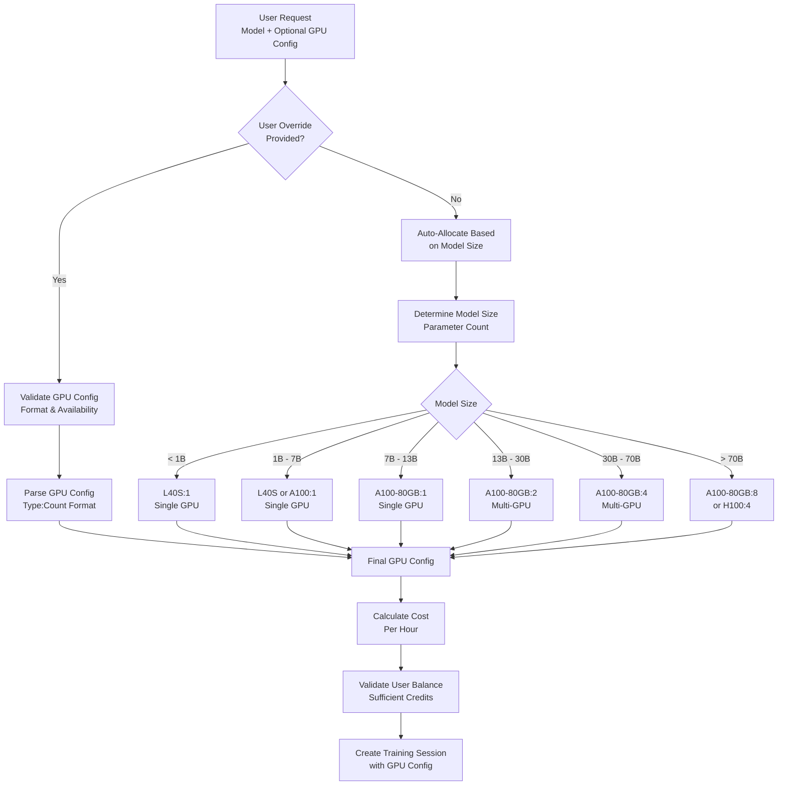
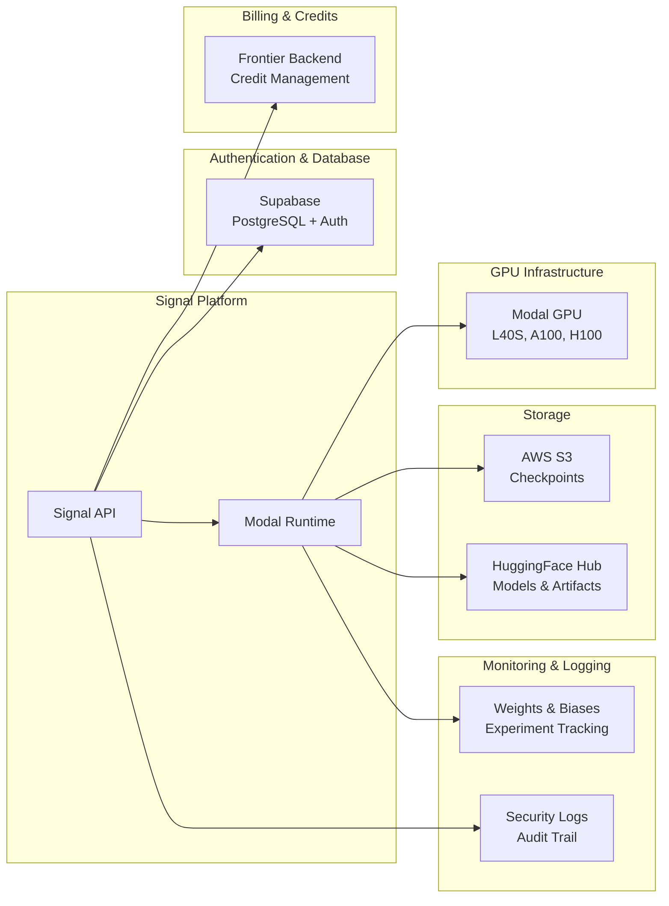

# Signal Codebase Visualization

This document provides comprehensive visualizations of the Signal codebase architecture, dependencies, and structure.

## 1. High-Level Architecture Overview



## 2. Core API Flow



## 3. Module Dependencies



## 4. Data Flow Architecture



## 5. Training Session State Machine



## 6. GPU Allocation Strategy



## 7. File Structure Overview

```
signal/
├── api/                          # FastAPI application
│   ├── auth.py                  # Authentication & JWT
│   ├── registry.py              # Run management
│   ├── models.py                # Model registry
│   ├── schemas.py               # Pydantic models
│   ├── pricing.py               # Cost calculation
│   ├── gpu_allocator.py         # GPU allocation logic
│   ├── frontier_client.py       # Billing integration
│   ├── future_store.py          # Async operation storage
│   ├── openai_compat.py         # OpenAI-compatible API
│   ├── supabase_client.py       # Database client
│   └── logging_config.py        # Security logging
├── modal_runtime/               # Modal GPU infrastructure
│   ├── app.py                   # Modal app configuration
│   ├── training_session.py      # Stateful training session
│   ├── model_loader.py          # Model loading utilities
│   ├── gpu_monitor.py           # GPU monitoring
│   ├── metrics.py               # Training metrics
│   ├── cleanup.py               # Resource cleanup
│   ├── s3_client.py             # S3 storage client
│   ├── trl_trainers.py          # TRL training utilities
│   └── utils/                   # Training utilities
│       ├── paths.py             # Path management
│       ├── checkpoint.py        # Checkpoint handling
│       ├── tokenization.py     # Text tokenization
│       └── preference_utils.py # Preference learning
├── client/                      # Python SDK
│   ├── rewardsignal/           # SDK package
│   │   ├── client.py           # Main client
│   │   ├── async_client.py     # Async client
│   │   ├── inference_client.py # Inference operations
│   │   ├── training_client.py  # Training operations
│   │   ├── futures.py          # Async futures
│   │   ├── schemas.py          # SDK schemas
│   │   └── exceptions.py       # Custom exceptions
│   └── examples/               # Usage examples
├── config/                      # Configuration files
│   ├── models.yaml             # Supported models
│   └── pricing.yaml            # GPU pricing
├── scripts/                     # Utility scripts
│   ├── migrations/              # Database migrations
│   └── *.py                    # Setup & management scripts
├── tests/                       # Test suite
└── main.py                     # Application entry point
```

## 8. Key Design Patterns

### Stateful Training Session
- **Pattern**: Stateful Modal class with persistent state
- **Benefits**: Maintains model, optimizer, and training state across API calls
- **Implementation**: `TrainingSession` class with `@modal.enter()` lifecycle

### Composable Training Primitives
- **Pattern**: Four core primitives (forward_backward, optim_step, sample, save_state)
- **Benefits**: Full control over training loop while handling infrastructure
- **Implementation**: Each primitive is a Modal method with GPU allocation

### Automatic GPU Allocation
- **Pattern**: Model-size-based GPU allocation with user override capability
- **Benefits**: Optimal resource usage without manual configuration
- **Implementation**: `gpu_allocator.py` with size-based rules

### Async Futures API
- **Pattern**: Non-blocking operations with future-based results
- **Benefits**: Better resource utilization and user experience
- **Implementation**: `future_store.py` with Redis-like storage

### Multi-GPU Transparency
- **Pattern**: Single-GPU API that scales to multi-GPU automatically
- **Benefits**: Same API works regardless of GPU count
- **Implementation**: Accelerate library with FSDP for multi-GPU

## 9. External Integrations



This visualization shows Signal as a sophisticated ML training platform that abstracts away infrastructure complexity while providing fine-grained control over the training process. The architecture is designed for scalability, reliability, and ease of use.
